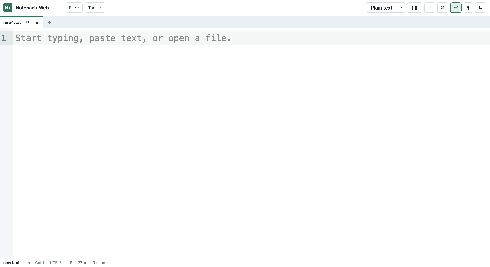
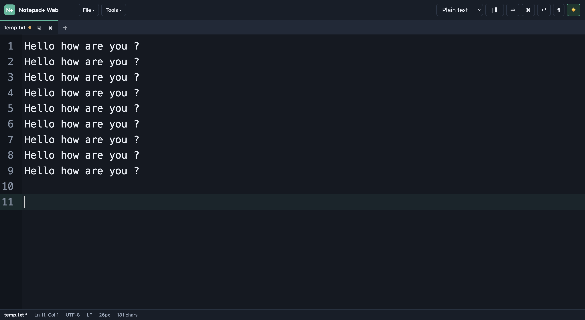
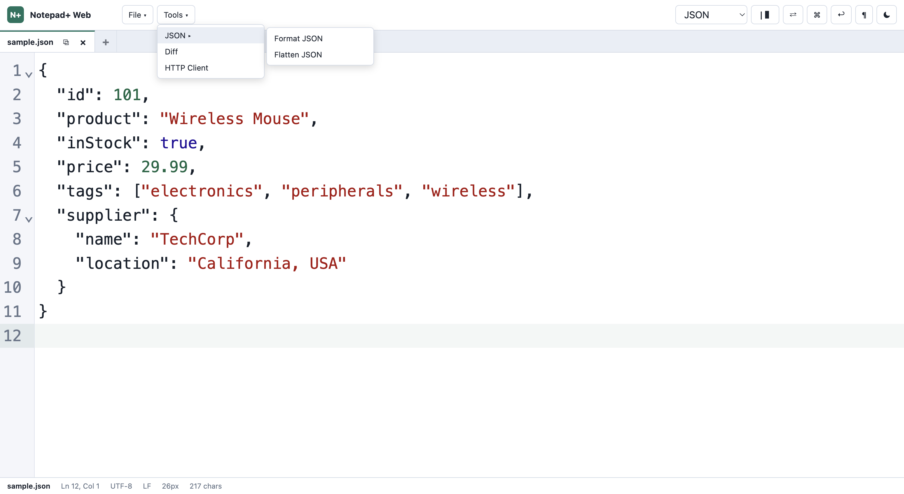
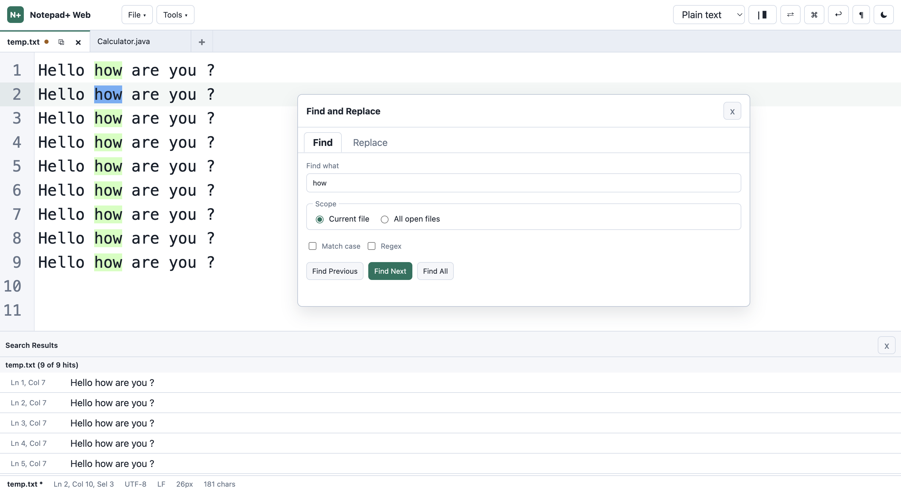
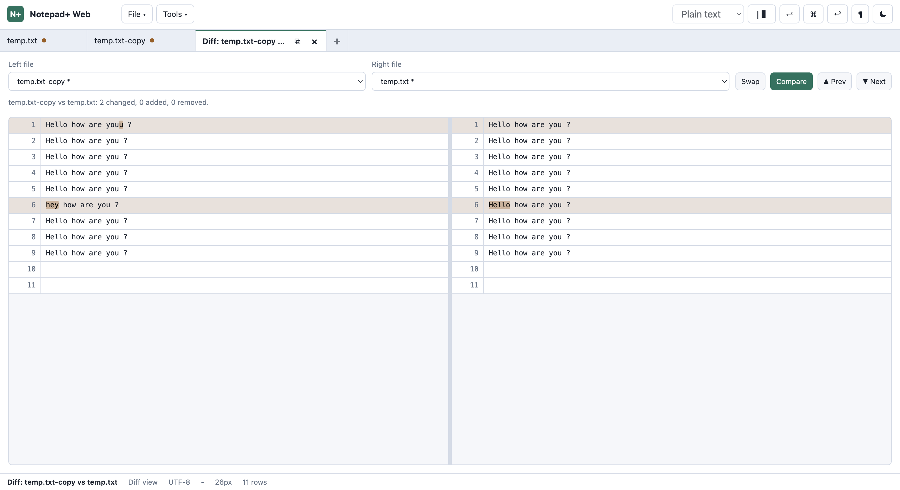
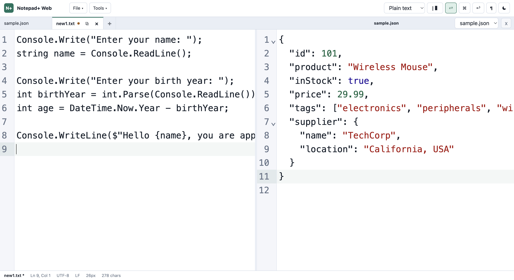
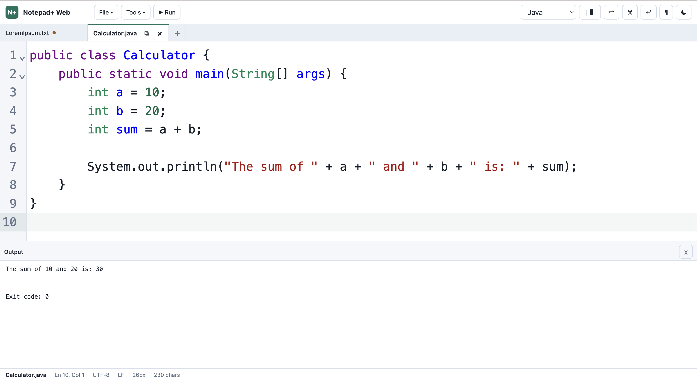

# Notepad+ Web

A fast, browser-based code editor inspired by Notepad++. Works on macOS, Windows, and Linux — no installation required beyond Node.js.

## Screenshots

**Default view**


**Dark mode**


**JSON tools**


**Find & Replace**


**Side-by-side Diff**


**Split view**


**Code Runner**


## Quick Start

```bash
git clone https://github.com/Tarun097/Notepad-Web.git
cd Notepad-Web
./run.sh
```

Then open [http://localhost:5173](http://localhost:5173) in your browser.

### macOS: Install as App (Spotlight-searchable)

```bash
./install-mac.sh    # Creates app + background server
./uninstall-mac.sh  # Removes everything
```

After install, search **"Notepad+ Web"** in Spotlight to launch instantly.

## Features

### Editor
- Multi-tab editing with dirty indicators and close buttons
- Syntax highlighting for 13 languages (JS, TS, HTML, CSS, JSON, Markdown, Python, SQL, Java, C++, C#, Groovy)
- Line numbers, code folding, bracket matching, autocomplete
- Multi-cursor and column editing
- Word wrap, visible whitespace, font zoom (8–72px)
- Light/dark theme toggle
- **Inline tab rename** (double-click tab name)
- **All tabs closeable** (including the last one)
- **Go to Line** (Ctrl/Cmd+G)

### File Management
- Open/Save/Save As via File System Access API
- Drag-and-drop tab reordering
- Open Recent Files
- IndexedDB file handle persistence (Ctrl+S works across reloads)
- Language-aware Save As dialog (suggests correct extension)
- Duplicate tab (marked as unsaved)

### Search
- Find & Replace (current file or all open files)
- Regex support
- Results panel with paginated "Load more" for large files

### Tools
- **JSON** → Format / Flatten
- **Diff** — side-by-side comparison with inline char highlighting, paginated for large files
- **HTTP Client** — Postman-style requests, collections, history, import/export
- **Code Runner** — execute Java, C++, C#, Groovy, Python directly

### Keyboard Shortcuts

| Action | Shortcut |
|--------|----------|
| New file | Ctrl/Cmd+N |
| Open | Ctrl/Cmd+O |
| Save | Ctrl/Cmd+S |
| Save As | Ctrl/Cmd+Shift+S |
| Close tab | Ctrl/Cmd+W |
| Find | Ctrl/Cmd+F |
| Replace | Ctrl/Cmd+H |
| Go to Line | Ctrl/Cmd+G |
| Format JSON | Ctrl/Cmd+Shift+J |
| Diff | Ctrl/Cmd+Shift+D |
| Command Palette | Ctrl/Cmd+Shift+P |
| Zoom in/out | Ctrl/Cmd+=/- |

## Tech Stack

- **Vite** + **TypeScript** (build & dev)
- **CodeMirror 6** (editor engine)
- **File System Access API** (native file open/save)
- **IndexedDB** (file handle persistence)
- **localStorage** (session restore)

## Prerequisites

- **Node.js** v18+ 
- For Code Runner: Java, g++, dotnet, groovy, or python3 installed locally

## Development

```bash
npm install
npm run dev        # Dev server on :5173
npm run build      # Production build
```

## License

MIT
